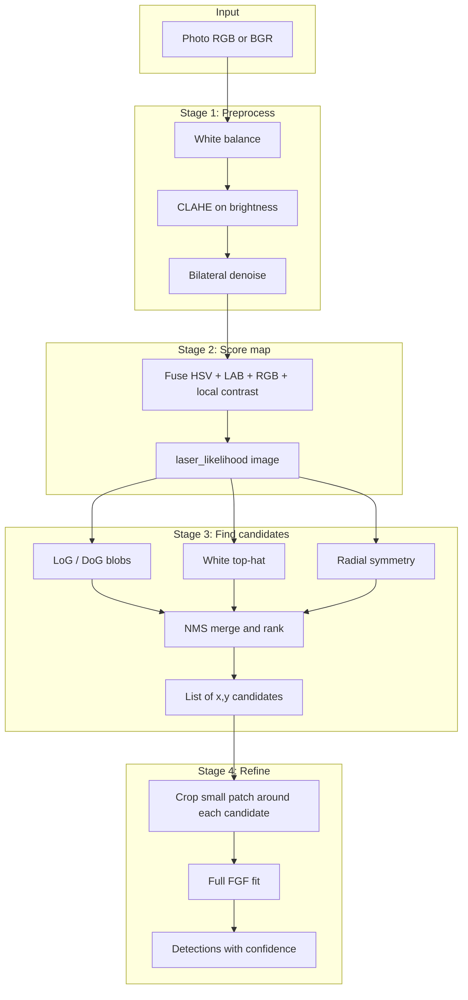
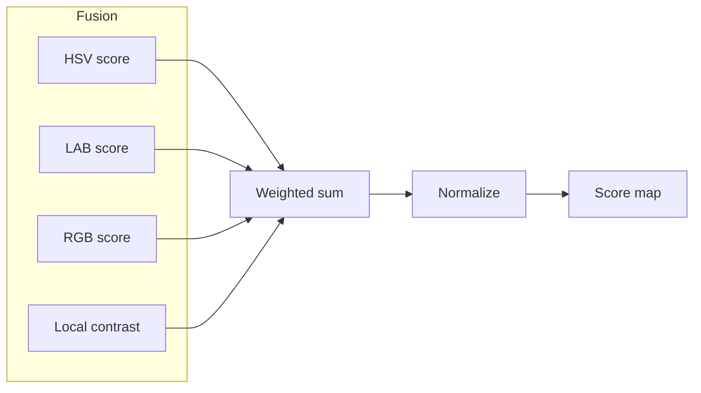
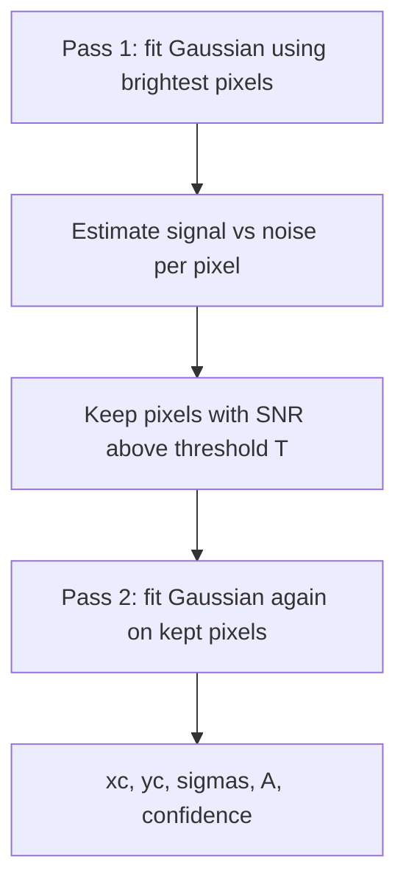
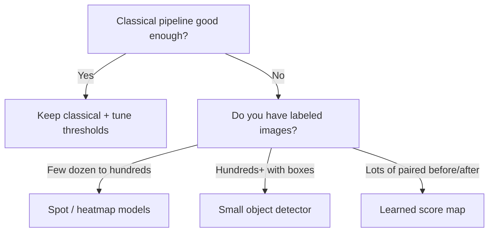
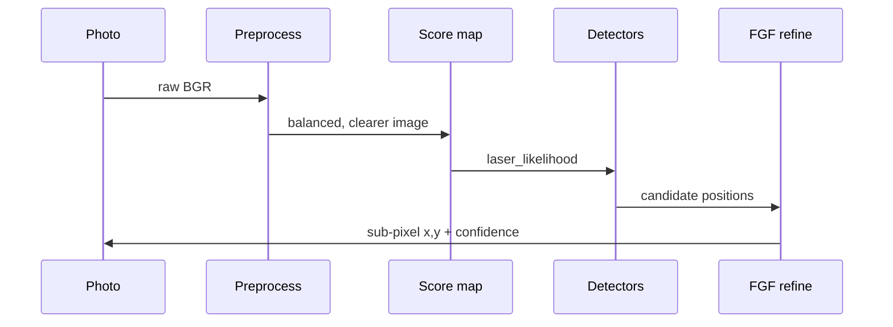

# Laser Detection Pipeline — User Guide

This document explains **what each step does**, **why it is there**, and **which methods** the code uses. It is written in plain language. For the mathematical details of the centroiding algorithm, see `star-centroiding.pdf` in this folder.

---

## What problem are we solving?

Photos of fish often contain a **small bright laser dot** (red or green). The dot may be:

- faint or washed out by water and lighting,
- similar in color to fish spots or reflections,
- only a few pixels wide.

The pipeline turns a color photo into a list of **candidate dot positions** with **sub-pixel accuracy** and a **confidence score**, without training a neural network first.

---

## Big picture: four stages



**In one sentence:** we clean the image, build a “how laser-like is each pixel?” map, find bright blob-like spots in several ways, then fit a Gaussian to each patch to get an exact center.

---

## Stage 1 — Preprocessing (`preprocess.py`)

| Step | Simple idea | Method used |
|------|-------------|-------------|
| **Load** | Read PNG, WebP, etc. | OpenCV `imread`, or Pillow fallback for unusual formats |
| **White balance** | Underwater photos look too blue/green; we nudge colors so average “gray” is more neutral | **Gray-world**: scale each color channel so channel means match the overall gray level |
| **CLAHE** | Make local contrast stronger so a tiny bright dot pops a bit more without blowing up the whole image | **CLAHE** on the **L** channel of **LAB** color space (brightness only, hue mostly preserved) |
| **Denoise** | Reduce grainy noise but keep sharp edges (the dot edge) | **Bilateral filter** (smooth similar neighbors, preserve edges) |

**Why it matters:** If we skip this, the next steps see more noise and wrong colors, so false “bright spots” increase.

---

## Stage 2 — Laser likelihood map (`color_scoring.py`)

We need a **single grayscale image** where high values mean “this pixel looks like our laser,” for both **red** and **green** lasers.

| Ingredient | Simple idea | How it works here |
|------------|-------------|-------------------|
| **Auto color** | Decide red vs green without you picking | Compare a simple red score vs green score on the whole image; whichever peaks higher wins |
| **HSV** | Lasers are often **saturated** and **bright**, with a clear **hue** | Mask hue to red or green ranges; multiply saturation × brightness |
| **LAB** | Separate “how light” from “what color” | Use the **a\*** axis (red–green) in a way that favors red or green lasers |
| **RGB difference** | Old trick: red laser ⇒ more red than green/blue | `r - 0.5g - 0.5b` for red; `g - 0.5r - 0.5b` for green |
| **Local contrast** | A dot is **brighter than its neighborhood** | Compare each pixel to a local average and local spread (z-score style), then squash to 0–1 |

These pieces are **weighted and combined**, then **normalized** so the map uses the full 0–1 range when possible.



---

## Stage 3 — Candidate detection (`detectors.py`)

The score map still has **many** bright pixels. We ask **three different detectors** “where are the small bright blobs?” and merge answers.

| Detector | Simple idea | Method |
|----------|-------------|--------|
| **LoG / DoG** | Find **round blobs** at several **sizes** (like tuning a microscope) | **Laplacian of Gaussian** and **Difference of Gaussians** via `scikit-image` blob detectors |
| **White top-hat** | Subtract a “smoothed background” to leave **only small bright bumps** | **Morphology**: opening with a disk, then `image − opened` |
| **Radial symmetry** | A laser dot looks like a **little sun** — gradients point toward the center | **Fast radial symmetry** (gradient voting), vectorized for speed |

Then **NMS (non-maximum suppression)**: if two detections are very close, keep the stronger one so we do not count the same dot three times.

The pipeline also **always considers the global maximum** of the score map as a candidate, so the brightest laser-like pixel is never skipped just because another detector missed it.

---

## Stage 4 — Sub-pixel refinement (`fgf_full.py`)

A laser dot on the sensor is often modeled as a **2D Gaussian bump** (spread of light across pixels). **FGF (Fast Gaussian Fitting)** estimates center \((x_c, y_c)\), widths \(\sigma_x, \sigma_y\), and amplitude \(A\).

**Paper workflow (simplified):**



- **Pass 1** uses a **closed-form linear least squares** setup (log-intensity formulation) so we avoid slow iterative optimizers.
- We estimate **noise** as observed minus fitted Gaussian, then **SNR** per pixel.
- **Pass 2** refits using only pixels where SNR is high enough (default \(T = 3\), as in the paper).

**Confidence** mixes: how well the Gaussian matches the patch, peak vs background, reasonable blob size, and (in `pipeline.py`) how strong the **candidate response** was on the score map.

The orchestrator runs FGF on both the **score patch** and the **grayscale intensity patch** and keeps the **better** fit, because sometimes one representation is cleaner.

---

## How `pipeline.py` ties it together

1. Load image → optional preprocess.  
2. Build score map → auto red/green.  
3. Run detectors + add score-map peak → list of \((y, x)\) with a response strength.  
4. For each candidate, crop a patch, run **dual FGF**, blend confidence with response.  
5. Drop low confidence, **deduplicate** nearby duplicates, sort by confidence, cap count.

---

## Project file map

```text
preprocess.py     Stage 1: clean and enhance image
color_scoring.py  Stage 2: laser_likelihood map
detectors.py      Stage 3: blobs, top-hat, radial symmetry, NMS
fgf_full.py       Stage 4: full two-pass FGF + confidence
pipeline.py       Wires everything: detect_laser(...)
fgf.ipynb         Notebook demos and comparisons
star-centroiding.pdf  Reference paper for FGF
```

---

## Machine learning — when and what to use

The **current pipeline is classical** (no training data required). Consider ML if you still see **systematic failures**: many false dots on certain tanks, missed dots in turbid water, or lasers that are not red/green.

### Decision guide



### Recommended directions (high level)

| Approach | What it does | Pros | Cons |
|----------|----------------|------|------|
| **Spot / puncta models** (e.g. Spotiflow, deepBlink-style heatmaps) | Predict a **probability map** where peaks are dot centers | Strong on tiny bright points; can work with **few** crops | Needs install + maybe light fine-tuning |
| **Small detector** (e.g. YOLOv8-nano, RT-DETR-tiny) | Predict **bounding boxes** for dots | Good if dots vary in size and you have **many** labeled frames | Annotation cost; overkill for one dot per image |
| **Learned score map** (small U-Net or similar) | Replace hand-crafted HSV/LAB fusion with a **learned** “laser likelihood” | Adapts to your exact camera and water conditions | Needs **paired** data or masks; training pipeline |

### Practical recommendation

1. **First:** tune `min_confidence`, `pad`, and preprocessing flags on your real dataset.  
2. **If** false positives dominate: add a **temporal** cue (video) or a **second-stage classifier** on small crops (tiny CNN or logistic regression on patch features).  
3. **If** misses dominate: try a **heatmap** model trained on dot-centered crops before jumping to full object detection.

Consult before adding ML so we can match **data availability**, **latency**, and **deployment** (CPU vs GPU).

---

## Further reading

- **Star centroiding / FGF:** `star-centroiding.pdf` (Wan et al., 2018) — Sections 2.3–2.4 describe the fast Gaussian fit and two-pass SNR selection.  
- **Blob detection:** scikit-image tutorials on `blob_log` / `blob_dog`.  
- **Radial symmetry:** Loy & Zelinsky (2003), “Fast radial symmetry for detecting points of interest.”

---

## Diagram: from photo to detections



This matches the mental model: **clean → score → find → refine**.
